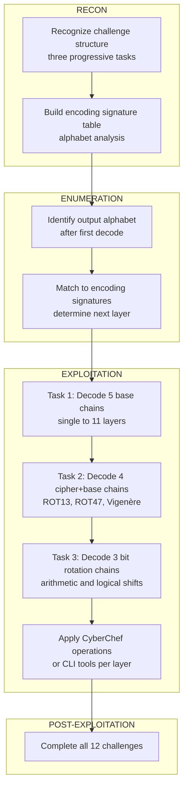

# Break It

<table>
<tr><td><strong>Platform</strong></td><td>TryHackMe</td></tr>
<tr><td><strong>Difficulty</strong></td><td>Medium</td></tr>
<tr><td><strong>URL</strong></td><td><a href="https://tryhackme.com/room/breakit">https://tryhackme.com/room/breakit</a></td></tr>
<tr><td><strong>Focus</strong></td><td>Multi-layer encoding chains: Base32, Base58, Base64, Base85, Base91 → classical ciphers (ROT13, ROT47, Vigenère) → bit rotation operations</td></tr>
</table>

---

## Overview `[RECON]`

Break It is a Medium-level challenge focused on recognizing and decoding chained encoding systems. The room is divided into three progressive tasks:

- **Task 1 — Bases:** Strings encoded in multiple base systems (Base32, Base58, Base64, Base85, Base91)
- **Task 2 — Base and cipher:** Combinations of encoding with classical ciphers (ROT13, ROT47, Vigenère)
- **Task 3 — Base, cipher, bit shift:** Bit-level operations on binary data

**Key principle:** The output alphabet at each decoding layer is the clue for identifying the next layer. Recognizing encoding signatures by character composition is more reliable than memorizing encoding names.

---

## Encoding Signature Reference `[RECON]`

The following table serves as a quick lookup for identifying encodings based on output characteristics:

| Output Characteristics | Likely Encoding |
|---|---|
| Uppercase + digits `2-7`, padding `=` | Base32 |
| Mixed case, digits, `+`, `/`, padding `=` | Base64 |
| Alphanumeric lacking `0`, `O`, `I`, `l`, no symbols | Base58 |
| Dense punctuation, ASCII range 33–117 | Base85 |
| Letters, digits, symbols including `"`, no `'` or `\` | Base91 |
| Numbers separated by spaces, range 0–127 | Decimal ASCII |
| Only `0-9` and `a-f`, even length | Hex |
| Readable text with shifted letters | ROT13 / Caesar / Vigenère |

---

## Task 1: Base Decoding Chains `[EXPLOITATION]`

### Challenge 1: Single Base32

**Input:** `MVQXG6K7MJQXGZJTGI======`

**Decoding pipeline:**

```bash
echo "MVQXG6K7MJQXGZJTGI======" | base32 -d
```

Output: `REDACTED`

Single-layer Base32 decoding. The padding `======` and uppercase+digits `2-7` alphabet immediately identify Base32.

---

### Challenge 2: Stacked Base64 and Base32

**Input:** `TVJYWEtZVE1NVlBXRVlMVE1WWlE9PT09`

**Decoding pipeline:**

```bash
echo "TVJYWEtZVE1NVlBXRVlMVE1WWlE9PT09" | base64 -d | base32 -d
```

Output: `REDACTED`

Base64 decoding produces an output with exact Base32 signature (uppercase, `2-7`, padding `=`), requiring a second pass. The challenge name is literal: **two bases**.

---

### Challenge 3: Four-Layer Base Chain

**Input:** `GM4HOU3VHBAW6OKNJJFW6SS2IZ3VAMTYORFDMUC2G44EQULIJI3WIVRUMNCWI6KGK5XEKZDTN5YU2RT2MR3E45KKI5TXSOJTKZJTC4KRKFDWKZTZOF3TORJTGZTXGNKCOE=====`

**Decoding steps:**

1. Base32 → output contains punctuation (Base85 signature)
2. Base85 (with "Remove non-alphabet" enabled) → alphanumeric mix without `0`, `O`, `I`, `l` (Base58 signature)
3. Base58 → pairs of hex digits
4. Hex decode → Base64-valid output
5. Base64 → `REDACTED`

The flag itself confirms the technique: Base16 and hexadecimal are equivalent.

---

### Challenge 4: Seven-Layer Cascade

**Input:** `HRBUGQDUHFWDIXKUIBWXIJTHIE3DCY3BIE2FKQSZHNDE6MRUIA2TWWDMHRBV2ZKCHQWFCTLPIE2EEJDBIBZCEW3OHUSTOLRCHNFGMVC6IFJXIQ2AHVMVONSBHVOVIM2MHVPV42J4H...`

**Decoding sequence:** Base32 → Base85 → Base64 → Base58 → Base85 → Base64 → Base64 → `REDACTED`

Seven nested layers. Each intermediate output's alphabet is the navigation guide to the next decoder. Using CyberChef's "Remove non-alphabet chars" option handles spurious bytes between layers.

---

### Challenge 5: Eleven-Layer Complex Chain

**Input:** `GIUTMORPGBFEMVRKGEVECRZRFM7GGJRDGFDVKKBRGITT2XZYFM7FSYTRGIUUQRRVGBEGALZMFM7GYIZBGNBCMJZ2GEVECRZOFM7GW23SGFDVKKBRGFQSEWJRFM7FSYTRGIUS2NBRGMSDU...`

**Decoding sequence:**

Base32 → Base85 → Decimal ASCII (space-delimited) → Hex → Base91 → Base58 → Hex → Base64 → Decimal ASCII → Hex → `REDACTED`

Eleven layers including mixed encoding and number formats. Key identification markers:
- After Base85, space-separated numbers = Decimal ASCII
- After Decimal, hex pairs with characters including `"` = Base91
- Alphanumeric lacking `0`, `O`, `I`, `l` = Base58

This challenge consolidates techniques from earlier tasks.

---

## Task 2: Encoding + Classical Ciphers `[EXPLOITATION]`

### Challenge 1: Base32 + ROT13

**Input:** `PJXHQ4S7GEZV6ZTDOZQQ====`

**Decoding pipeline:**

```bash
echo "PJXHQ4S7GEZV6ZTDOZQQ====" | base32 -d | tr 'A-Za-z' 'N-ZA-Mn-za-m'
```

Output: `REDACTED`

Base32 produces intermediate gibberish (`znxr_13_fcva`). ROT13 (rotate all letters by 13 positions) reveals the flag.

---

### Challenge 2: Base64 + Base85 + Vigenère

**Input:** `NjZMKVhATl1EcEI2Jio4Q0xuVy1EZSo5ZkFLV0M6QVUtPFpGQ0InIkReYg==`

**Decoding sequence:**

1. Base64 decode
2. Base85 decode (with "Remove non-alphabet")
3. Vigenère decode using key: `tango`

Output: `REDACTED`

The Vigenère key (`tango`) does not appear in the challenge description. CyberChef's Vigenère Crack tool or context-aware guessing (common words, challenge theme) is required.

---

### Challenge 3: Base85 + ROT47 + Multi-Base Chain

**Input:** `-!r/X,]n/Z-Zs\X,X$,rl<@]#-9Oh,-=A]R-p9\+`

**Decoding sequence:**

1. Base85 (with "Remove non-alphabet") → bytes in ASCII range 33–126
2. **ROT47** (not ROT13) — rotates all printable ASCII characters (33–126), not just letters
3. Base64 → Base32 → ROT13 → `REDACTED`

**Critical distinction:** ROT47 operates on the full printable ASCII range, not alphabetic characters alone. This is the key differentiator when facing binary-like output from Base85.

---

### Challenge 4: Complex Multi-Stage Vigenère

**Input:** `GZXSMPKXH4RGE4TKGQSVKYS3HJEUCXDMGJPDAXCSIE2SGQSIIFIWQRJZGBUUGKJJFU4T24DJIFISQSZSFY4VKMKUGZXSI2DLHRRTSXLKGQSVKYS3HUSG4LJQGFCW4OCOIE2SIZTAGQSSCJLFGB`

**Decoding sequence:**

Base32 → Base85 → Base91 → Decimal ASCII (space-delimited) → Hex → Base64 → Base58 → Vigenère decode (key: `tangodown`) → `REDACTED`

Eight base layers plus two cipher types. The Vigenère key (`tangodown`) appears embedded in the Base58-decoded output before the cipher layer, serving as a self-documenting clue visible in CyberChef's process chain.

---

## Task 3: Bit Rotation Operations `[EXPLOITATION]`

### Terminology: Arithmetic vs. Logical Shift

| Operation | CyberChef | Behavior |
|---|---|---|
| Arithmetic Shift | `Rotate Left` (no carry) | Each byte rotates independently; bit exiting one byte does not propagate to the next |
| Logical Shift | `Rotate Left` (carry through) | Bits propagate across byte boundaries; a bit exiting one byte enters the next |

CyberChef's `Rotate Left` operation with and without the "Carry through" checkbox directly replaces Hex Workshop's shift/rotate buttons.

---

### Challenge 1: Single Bit Rotation with Carry

**Input:** `2D 37 2B 19 31 99 31 B3 B2 AB A5 18 32 37 20 B3 B2 AC 2D 1A 31 B4 A1 3A A4 A3 9C B4 AD 36 AC 9E`

**Decoding sequence:**

1. Hex decode (auto)
2. Rotate Left (Amount: 1, **carry through enabled**)
3. Base64 decode (with "Remove non-alphabet chars")
4. ROT13 → `REDACTED`

Carry-through rotation propagates the bit exiting one byte into the next, creating a valid Base64 output. The "Remove non-alphabet" option cleans an invalid trailing character.

---

### Challenge 2: Arithmetic Rotation (No Carry)

**Input:** `19 1A 1C 99 1C 9C A8 38 27 B2 34 27 B9 27 26 28 3C 3B AA 28 A5 AA 2A 29 3C 29 B2 B2 21 B1 AC A6 1C AC 29 A8 38 99 2C`

**Decoding sequence:**

1. Hex decode (auto)
2. Rotate Left (Amount: 1, **no carry**)
3. Base58 decode (with "Remove non-alphabet chars")
4. ROT13 → `REDACTED`

Without carry, each byte rotates independently. The resulting alphabet matches Base58 signature (alphanumeric, no `0`, `O`, `I`, `l`). The flag name (`shift arithmetic like a boss`) is a hint to the rotation method.

---

### Challenge 3: Multi-Stage Bit Operations

**Input:** `A9 A8 2B EE 2A AA C9 C8 C9 AA A8 0F 2A 8A AA EE A9 8A CA A8 A9 4F 6D 46 E9 A8 A8 0F A9 8A 6D 86 A9 AA A9 26 2A 8A 48 E8`

**Decoding sequence:**

1. Hex decode (auto)
2. Rotate Left (Amount: 3, **no carry**) — each byte rotates independently
3. Base64 decode (with "Remove non-alphabet chars")
4. Hex decode (auto)
5. Rotate Left (Amount: 2, **carry through enabled**) — bits propagate across bytes
6. Base85 decode (with "Remove non-alphabet chars")
7. ROT13 → `REDACTED`

Five distinct operations. The challenge embeds a hint in the decoding flow: "Arithmetic (8 bits), base, logic, base, rot" maps directly to the sequence (arithmetic rotate, Base64, logical rotate, Base85, ROT13).

**Key insight:** Rotating by 3 positions in arithmetic mode (no carry) affects only the bits within each byte, not across boundaries. This is why `Amount: 3` (not a larger modular equivalent) is used despite the 8-bit byte size.

---

## Key Concepts `[ENUMERATION]`

**Encoding Alphabet as Navigation**

Each encoding has a distinct character set. Rather than memorizing encoding names, learn what each set contains and what it excludes. Base58 is recognized by the absence of `0`, `O`, `I`, `l` — characters often confused in alphanumeric contexts. Base85 is recognized by the presence of punctuation in ASCII range 33–117. This alphabet-first approach is faster than trial-and-error decoding.

**ROT47 vs. ROT13**

ROT13 rotates only alphabetic characters, leaving digits and symbols unchanged. ROT47 rotates all printable ASCII characters (codes 33–126), including punctuation. When the intermediate output of Base85 decoding contains raw binary-like bytes in that ASCII range, ROT47 is the applicable cipher, not ROT13.

**Bit Rotation Context**

Arithmetic and logical shifts are not the conventional bit shifts of low-level programming. In this room, both are rotations — the bit exiting one end re-enters the other. The difference is scope: arithmetic rotation confines each byte to itself, while logical rotation allows bits to flow across byte boundaries. Understanding when to apply each depends on the expected output format (Base64 typically requires carry-through; Base58 typically does not).

---

## Lessons Learned

- The output alphabet is the most reliable guide to identifying the next decoding layer. Spend time memorizing which characters belong to which encoding.
- CyberChef is sufficient for all three tasks; Hex Workshop is not required. Understanding the operation (what it does) is more important than the tool choice.
- Vigenère keys hidden in challenge descriptions often appear as context clues or are embedded in the decoded output of prior layers.
- ROT47 is a frequent trap when ROT13 is expected; check the ASCII range of the intermediate output to distinguish them.
- Bit-rotation carry-through is essential for multi-byte encodings like Base64; arithmetic (non-carry) rotation is appropriate for encodings that operate byte-by-byte like Base58.

---

## Attack Chain


