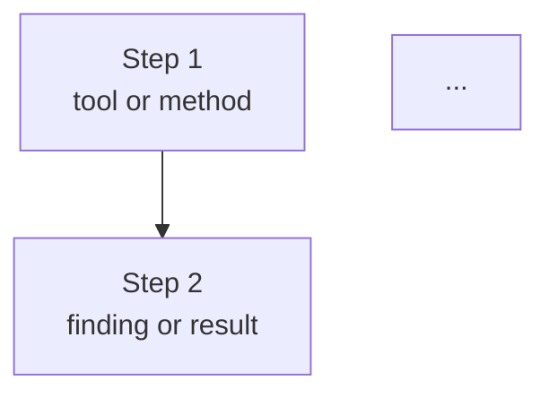

# lab-notes — CTF Writeup Prompt for renekerr/lab-notes

## Purpose

Convert raw CTF walkthrough notes into a clean, structured Markdown document for `github.com/renekerr/lab-notes`. Documents are technical references, not blog posts — no Jekyll front matter, no narrative tone. English only.

---

## Repository Structure

```
lab-notes/
├── easy/
│   └── vulnnet-internal.md
├── medium/
│   └── room-name.md
├── hard/
│   └── room-name.md
└── README.md
```

**Naming convention:** `room-name.md` (lowercase, hyphenated, no date prefix)
**Placement:** file goes in the folder matching the room difficulty

---

## Input Requirements

Provide:
1. **Raw walkthrough notes** (Markdown or plain text)
2. **Room URL**
3. **Platform** (TryHackMe, Hack The Box, PortSwigger, etc.)
4. **Difficulty** (Easy, Medium, Hard)

---

## Output Format & Structure

### 1. Title and Metadata Table

```markdown
# [Room Name]

| | |
|---|---|
| **Platform** | [TryHackMe / Hack The Box / PortSwigger / other] |
| **Difficulty** | [Easy / Medium / Hard] |
| **URL** | [full URL] |
| **Focus** | [one-line description of the main technique or chain] |
```

No front matter. No date. No tags section. Starts directly with the title.

---

### 2. Steps

One section per exploitation phase, in order. Each section:

```markdown
## [Descriptive Step Name] `[PHASE]`
```

Phases (always in English, always in brackets):
`[RECON]` `[ENUMERATION]` `[EXPLOITATION]` `[PRIVESC]` `[POST-EXPLOITATION]`

Each step contains:
- A one-line intro describing what the service/tool is and what it is used for in this specific context
- The relevant command(s) with output in the same code block
- A switch table if the command has non-obvious flags
- One or two lines summarizing the finding
- An optional `> **Note:**` for non-obvious context

**Code block format:**
```bash
command here

relevant output
output line 2
[...] if longer than 20 lines
```

**Switch table format:**
| Switch | Description |
|--------|-------------|
| `-x` | What it does |

**Rules:**
- Replace all real IPs: `<TARGET_IP>` and `<ATTACKER_IP>`
- Each piece of information appears only once, at the step where it is first used
- No flags or flag values anywhere in the document
- No whoami as a standalone verification step
- No numbering on steps — descriptive name + phase tag only
- Separator `---` between steps

---

### 3. Attack Chain

Mandatory section, placed after all steps.

```markdown
## Attack Chain


```

**Rules:**
- All node labels in double quotes
- Use `\n` for line breaks inside nodes
- No special characters inside nodes: no accents, no `→`, `_`, `?`, `>`, `@`, `#`, `{`, `}`, `(`, `)`
- Replace underscores with spaces
- Credentials with special characters: show only username and a generic reference
- Each node: what was done + how (tool or method)
- 8–15 nodes covering the full chain from recon to objective

---

### 4. Key Concepts *(optional)*

Include only when the room introduces a technique or service that benefits from a short explanation not already covered in the steps.

```markdown
## Key Concepts

**[Concept name]**

[2–4 sentences. What it is, how it works, why it matters in an offensive context.]
```

No bullet points. Short paragraphs only.

---

### 5. Lessons Learned *(optional)*

Non-obvious takeaways only. Maximum 5 items. Bullet list.

```markdown
## Lessons Learned

- [Specific, non-generic lesson derived from this room]
```

Exclude:
- Generic advice ("always run nmap first")
- Anything already covered in Key Concepts
- Obvious conclusions that restate what the steps show

---

## Content Rules

- **Language:** English throughout
- **Tone:** technical, impersonal, minimal — just enough to understand how to reproduce the result
- **No narrative:** no first person, no "I tried", no process commentary
- **No flags:** never include actual flag values — if a flag appears in a command output, replace it with `REDACTED`
- **Cookies, tokens, and session values** captured from responses: truncate after the first 20 characters and append `[...]` — Example: `eyJ1c2VybmFtZSI6Ikd1ZXN0[...]`
- **Passwords and hashes** captured from files or command output: replace with `<PASSWORD>` or `<HASH>` respectively
- **No assumptions:** only document what appears in the notes
- **No external searches:** unless explicitly authorized
- **Spelling:** check before generating — no typos, no missing accents on technical terms that require them
- **Each data point appears once:** at the step where it is first used

---

## Validation Before Generating

Check that the notes include the following. If anything is missing, ask only for what is missing:

1. Platform and room URL
2. Difficulty level
3. Port scan output (nmap, rustscan, masscan) — clean format, no `|` sub-lines
4. Key command outputs: enumeration tools, web responses, shell access, privilege escalation
5. Exact file paths, wordlists, credentials used
6. Exploit details if applicable: path, parameters, adaptations
7. Escalation technique with verification commands
8. Any hashes: exact value, type, wordlist, result

---

## Final Checklist

- [ ] No Jekyll front matter
- [ ] Metadata table present (Platform, Difficulty, URL, Focus)
- [ ] All IPs replaced with `<TARGET_IP>` / `<ATTACKER_IP>`
- [ ] No flag values anywhere — flags visible in command output replaced with `REDACTED`
- [ ] Cookies, tokens, session values truncated to 20 chars + `[...]`
- [ ] Passwords and hashes replaced with `<PASSWORD>` / `<HASH>`
- [ ] Command and output in the same code block
- [ ] Switch tables for commands with non-obvious flags
- [ ] Each data point appears only once
- [ ] No whoami as standalone verification
- [ ] No step numbering
- [ ] Separators `---` between steps
- [ ] Attack Chain section present with valid Mermaid syntax
- [ ] No special characters or accents inside Mermaid nodes
- [ ] Key Concepts included only when genuinely needed
- [ ] Lessons Learned are non-obvious and non-generic
- [ ] File named `room-name.md` and placed in the correct difficulty folder
- [ ] Spelling checked

---

## How to Use

1. Paste this prompt + raw notes into Claude
2. Specify: platform, room URL, difficulty
3. Claude generates the `.md` file directly — no draft shown unless requested
4. Place the file in `easy/`, `medium/`, or `hard/` accordingly
5. Push to `github.com/renekerr/lab-notes`
